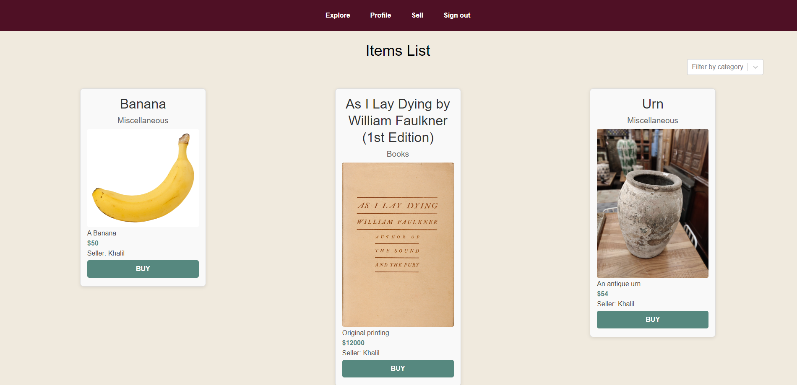
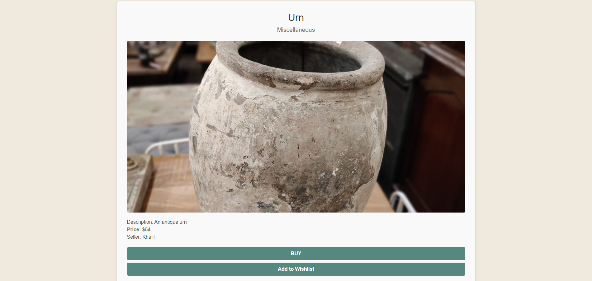
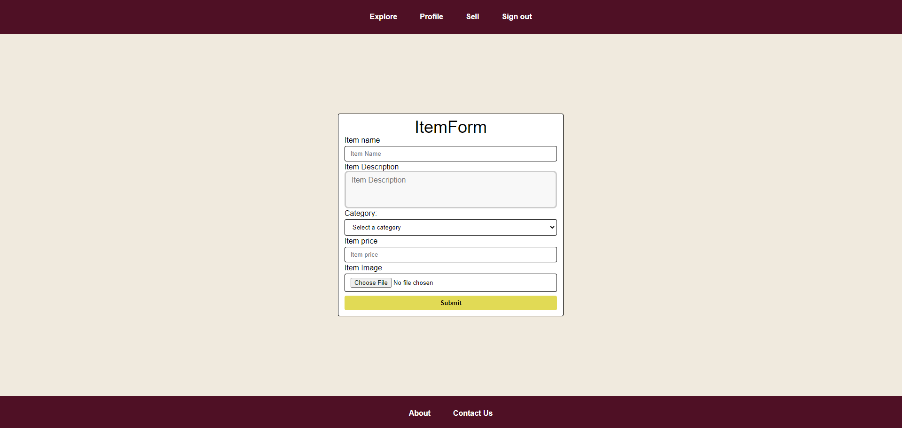
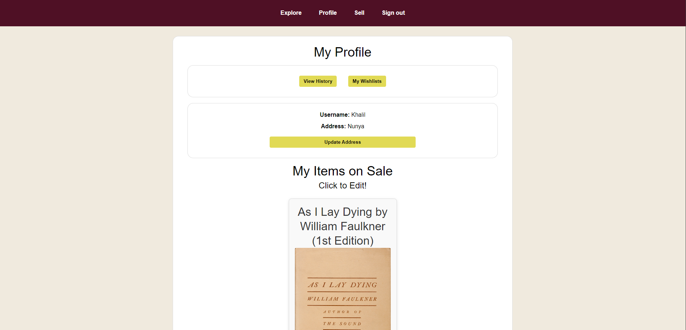
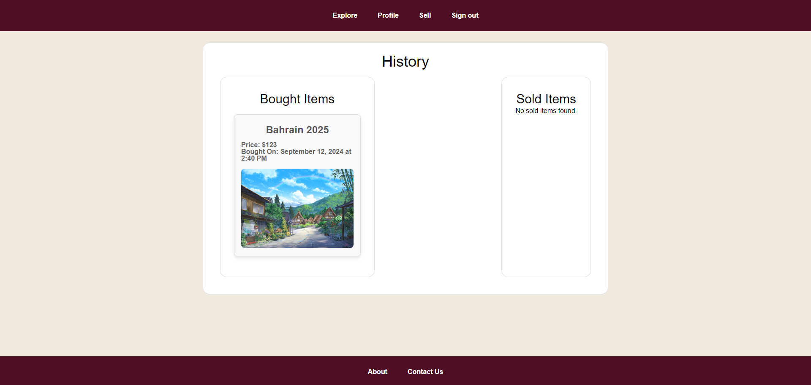
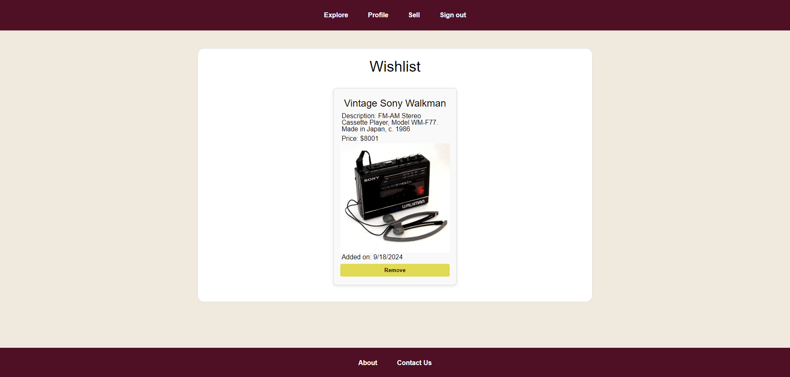

---

# Antique Marketplace

**Deployed Website:** [Click here!](https://marketplace-frontend-self.vercel.app/)

The Antique Marketplace is an e-commerce platform where you can sell and buy unique items. 

Built in MERN stack, it serves as a proof of concept for an online marketplace of rare goods.

## Screenshots

## Project Links
* [Backend](https://github.com/AliHussain-arch/MARKETPLACE-BACKEND)
* [Frontend](https://github.com/AliHussain-arch/MARKETPLACE-FRONTEND)

## Planning Documents

### Initial ERD

### Revised ERD:

### Wireframes

## Technologies Used

- React.js
- JavaScript
- HTML
- CSS
- Express
- Node.js
- MongoDB
- npm
- Amazon Web Services
- Prettier (code formatter)
- React Select

## Planned Future Enhancements

- Pagination for Explore page and comments.
- Form to apply for creation of new item categories and sub-categories.
- Search functionality.
- Shopping Cart.

---

